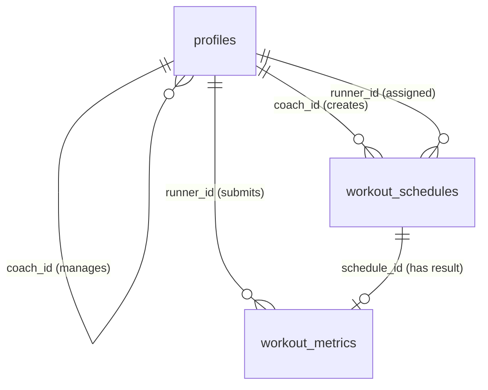

# Data Model & Schema Specification: Core Runner Coach Platform MVP

**Feature Branch**: `001-core-runner-platform` | **Date**: 2026-08-23 | **Spec**: [spec.md](file:///c:/Users/kellog/Documents/Data%20Process/runcoach/specs/001-core-runner-platform/spec.md)

## Data Overview

The data model for Runcoach MVP is stored in PostgreSQL via Supabase BaaS. It consists of custom custom types, three core tables (`profiles`, `workout_schedules`, `workout_metrics`), and strict Row Level Security (RLS) policies enforcing data isolation per UU PDP and Constitution standards.

---

## 1. Custom Types & Enums

### `user_role` (ENUM)
Defines the authorization role of a user in the application.
- `coach`: Pelatih lari who manages runners and schedules workouts.
- `runner`: Pelari who receives workout schedules and submits metrics.

---

## 2. Entities & Schema Definition

### 2.1 `profiles` Table
Stores extended user profile information linked to Supabase Auth (`auth.users`).

| Column Name | Type | Constraints | Description |
| :--- | :--- | :--- | :--- |
| `id` | `uuid` | PRIMARY KEY, REFERENCES `auth.users(id)` ON DELETE CASCADE | Unique user identifier matching Supabase Auth UID. |
| `email` | `text` | NOT NULL, UNIQUE | User email address. |
| `full_name` | `text` | NOT NULL | User's full display name. |
| `role` | `user_role` | NOT NULL | User role (`coach` or `runner`). |
| `coach_id` | `uuid` | NULLABLE, REFERENCES `profiles(id)` ON DELETE SET NULL | FK pointing to the Coach user who manages this Runner. Null if unlinked. |
| `created_at` | `timestamptz` | DEFAULT `now()`, NOT NULL | Timestamp when profile was created. |
| `updated_at` | `timestamptz` | DEFAULT `now()`, NOT NULL | Timestamp when profile was last updated. |

---

### 2.2 `workout_schedules` Table
Stores scheduled workout blocks created by Coaches for specific Runners.

| Column Name | Type | Constraints | Description |
| :--- | :--- | :--- | :--- |
| `id` | `uuid` | PRIMARY KEY, DEFAULT `gen_random_uuid()` | Unique schedule block identifier. |
| `coach_id` | `uuid` | NOT NULL, REFERENCES `profiles(id)` ON DELETE CASCADE | ID of the Coach who created this schedule. |
| `runner_id` | `uuid` | NOT NULL, REFERENCES `profiles(id)` ON DELETE CASCADE | ID of the Runner assigned to this schedule. |
| `title` | `text` | NOT NULL | Title of the workout (e.g., "Easy Run 5K", "Interval 4x800m"). |
| `description` | `text` | NULLABLE | Detailed instructions, pace targets, or workout notes. |
| `scheduled_date` | `date` | NOT NULL | Target calendar date for the workout execution. |
| `is_completed` | `boolean` | DEFAULT `false`, NOT NULL | Status flag indicating whether the Runner submitted metrics for this schedule. |
| `created_at` | `timestamptz` | DEFAULT `now()`, NOT NULL | Timestamp when schedule was created. |
| `updated_at` | `timestamptz` | DEFAULT `now()`, NOT NULL | Timestamp when schedule was last modified. |

---

### 2.3 `workout_metrics` Table
Stores actual workout execution metrics submitted by Runners.

| Column Name | Type | Constraints | Description |
| :--- | :--- | :--- | :--- |
| `id` | `uuid` | PRIMARY KEY, DEFAULT `gen_random_uuid()` | Unique metric log identifier. |
| `schedule_id` | `uuid` | NOT NULL, REFERENCES `workout_schedules(id)` ON DELETE CASCADE | FK link to the corresponding schedule item. |
| `runner_id` | `uuid` | NOT NULL, REFERENCES `profiles(id)` ON DELETE CASCADE | ID of the Runner submitting metrics. |
| `distance_km` | `numeric(6,2)` | NOT NULL, CHECK (`distance_km >= 0`) | Total running distance in kilometers (e.g., 5.25). |
| `duration_minutes` | `numeric(6,2)` | NOT NULL, CHECK (`duration_minutes >= 0`) | Total running duration in minutes (e.g., 28.50). |
| `heart_rate_bpm` | `integer` | NULLABLE, CHECK (`heart_rate_bpm > 0`) | Average heart rate in beats per minute (bpm). |
| `notes` | `text` | NULLABLE | Runner's feedback or subjective feeling notes. |
| `submitted_at` | `timestamptz` | DEFAULT `now()`, NOT NULL | Timestamp when metric was logged by Runner. |

---

## 3. Relationships & Indexes

### Entity Relationship Diagram (ERD)

### Performance Indexes
- `idx_profiles_role_coach`: `CREATE INDEX idx_profiles_coach_id ON profiles(coach_id);`
- `idx_workout_schedules_runner_date`: `CREATE INDEX idx_schedules_runner_date ON workout_schedules(runner_id, scheduled_date);`
- `idx_workout_schedules_coach_date`: `CREATE INDEX idx_schedules_coach_date ON workout_schedules(coach_id, scheduled_date);`
- `idx_workout_metrics_schedule`: `CREATE INDEX idx_metrics_schedule_id ON workout_metrics(schedule_id);`

---

## 4. State Transitions

### Workout Schedule Lifecycle
1. **Created (Pending)**: Coach adds a schedule block for a Runner on a date (`is_completed = false`).
2. **Rescheduled**: Coach drags and drops schedule block to a new date (`scheduled_date` updated via `dnd-kit`).
3. **Completed**: Runner submits `workout_metrics` linking to `schedule_id`. System sets `is_completed = true` on `workout_schedules`.
