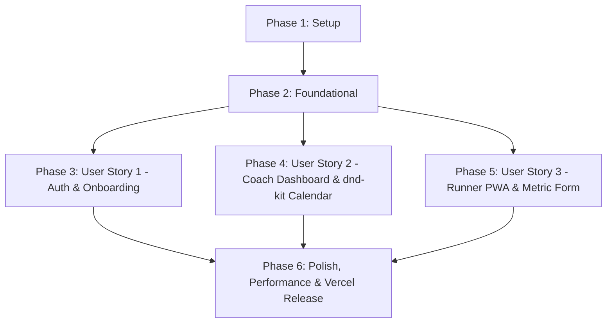

# Tasks: Core Runner Coach Platform MVP

**Feature Branch**: `001-core-runner-platform` | **Date**: 2026-08-23 | **Spec**: [spec.md](file:///c:/Users/kellog/Documents/Data%20Process/runcoach/specs/001-core-runner-platform/spec.md) | **Plan**: [plan.md](file:///c:/Users/kellog/Documents/Data%20Process/runcoach/specs/001-core-runner-platform/plan.md)

---

## Phase 1: Setup (Sprint 1 - Shared Infrastructure)

**Purpose**: Project initialization, core dependencies, and environment configuration.

- [ ] T001 Initialize Next.js 14+ App Router project structure in `package.json`, `next.config.mjs`, and `tailwind.config.js`
- [ ] T002 [P] Install core dependencies (`@supabase/supabase-js`, `@supabase/ssr`, `@dnd-kit/core`, `@dnd-kit/sortable`, `@ducanh2912/next-pwa`, `lucide-react`) in `package.json`
- [ ] T003 [P] Define TypeScript entity types matching data model in `src/types/index.ts`

---

## Phase 2: Foundational (Sprint 1 & 2 - Blocking Prerequisites)

**Purpose**: Core infrastructure that MUST be completed before user stories can proceed.

- [ ] T004 Create browser Supabase client initialization helper in `src/lib/supabase/client.ts`
- [ ] T005 [P] Create server-side Supabase client helper using `@supabase/ssr` in `src/lib/supabase/server.ts`
- [ ] T006 [P] Implement Supabase Auth session and RBAC route protection middleware in `src/lib/supabase/middleware.ts`
- [ ] T007 Apply database DDL schema and strict RLS policies script in `specs/001-core-runner-platform/contracts/supabase-schema.sql`
- [ ] T008 [P] Configure PWA Web App Manifest (`public/manifest.json`) and Service Worker wrapper in `next.config.mjs`

---

## Phase 3: User Story 1 - Autentikasi Peran & Akses Dasbor Terpisah (Priority: P1) 🌟 MVP

**Goal**: User login/signup, mandatory Role Selection onboarding (Coach vs Runner), and role-based dashboard redirection with UU PDP compliance.

**Independent Test**: Register a new user, complete Role Selection ("Saya Pelatih" vs "Saya Pelari"), verify Coach redirects to `/dashboard` and Runner to `/pwa/home`, and verify RLS prevents cross-role data access.

### Implementation for User Story 1

- [ ] T009 [P] [US1] Create Auth Login page component in `src/app/auth/login/page.tsx`
- [ ] T010 [P] [US1] Create Auth Signup page component in `src/app/auth/signup/page.tsx`
- [ ] T011 [US1] Implement Role Selection onboarding page with two visual cards ("Saya Pelatih" and "Saya Pelari") and disabled Back button navigation in `src/app/onboarding/role/page.tsx`
- [ ] T012 [US1] Implement Server Action for setting user role in `src/app/api/auth/role-selection/route.ts`
- [ ] T013 [US1] Create static Terms of Service page with health/medical disclaimer in `src/app/terms/page.tsx`
- [ ] T014 [P] [US1] Create static Privacy Policy page with health/medical disclaimer in `src/app/privacy/page.tsx`

**Checkpoint**: User Story 1 is complete. Users can authenticate, select roles, and get routed safely with full RLS protection.

---

## Phase 4: User Story 2 - Penyusunan & Penjadwalan Latihan Pelari via Kalender Drag-and-Drop (Priority: P1)

**Goal**: Coach Web Dashboard layout, Coach-Runner pairing modal via email input, and interactive calendar workout scheduling powered by `dnd-kit`.

**Independent Test**: Coach logs in, clicks "Tambah Pelari", inputs runner email, verifies runner links to roster, drags a workout block onto calendar date cell via `dnd-kit`, and verifies schedule persists in Supabase.

### Implementation for User Story 2

- [ ] T015 [P] [US2] Create Coach Web Dashboard layout shell in `src/app/dashboard/layout.tsx`
- [ ] T016 [P] [US2] Implement Link Runner modal component (email input field + submit button) in `src/components/coach/RunnerModal.tsx`
- [ ] T017 [US2] Implement Server Action to link runner email by updating `coach_id` in `src/app/api/coach/link-runner/route.ts`
- [ ] T018 [P] [US2] Implement draggable workout block component using `@dnd-kit/sortable` in `src/components/coach/ScheduleBlock.tsx`
- [ ] T019 [US2] Implement calendar grid container with `@dnd-kit/core` drop targets in `src/components/coach/Calendar.tsx`
- [ ] T020 [US2] Implement Server Action to create schedule block in `src/app/api/schedules/create/route.ts`
- [ ] T021 [US2] Implement Server Action to update schedule date on drag-and-drop in `src/app/api/schedules/reschedule/route.ts`
- [ ] T022 [US2] Connect Coach Dashboard page to render calendar and trigger client-side toast notifications on CRUD actions in `src/app/dashboard/page.tsx`

**Checkpoint**: User Story 2 is complete. Coaches can manage runners and schedule workouts via drag-and-drop.

---

## Phase 5: User Story 3 - Pelaporan Metrik Latihan Harian Pelari via PWA (Priority: P2)

**Goal**: Runner PWA interface, Unlinked Runner Empty State, Daily Workout Card, Metric Form with `<input inputmode="numeric">`, and Realtime metric sync to Coach.

**Independent Test**: Runner opens PWA on mobile view, sees Empty State if unlinked or today's workout card if linked, submits metrics via numpad keyboard, and verifies real-time updates appear on Coach Dashboard.

### Implementation for User Story 3

- [ ] T023 [P] [US3] Implement Unlinked Runner Empty State component ("Menunggu pelatih menautkan akun Anda.") in `src/components/runner/EmptyState.tsx`
- [ ] T024 [P] [US3] Create Runner PWA home page fetching today's workout schedule in `src/app/pwa/home/page.tsx`
- [ ] T025 [US3] Implement Runner Metric Input Form component using `<input inputmode="numeric">` for distance, duration, and heart rate in `src/components/runner/MetricForm.tsx`
- [ ] T026 [US3] Implement Server Action to submit workout metrics in `src/app/api/runner/submit-metric/route.ts`
- [ ] T027 [US3] Configure Supabase Realtime channel subscription on Coach Dashboard for instant metric submission updates in `src/components/coach/Calendar.tsx`

**Checkpoint**: User Story 3 is complete. Runners can log metrics seamlessly and coaches see updates in real-time.

---

## Phase 6: Polish & Cross-Cutting Concerns (Sprint 5 & 6)

**Purpose**: Skeleton UI components, sub-3-second load time optimization, and Vercel deployment configuration.

- [ ] T028 [P] Create reusable Skeleton UI placeholder components (Card, Button, Calendar, Table) in `src/components/ui/Skeleton.tsx`
- [ ] T029 [P] Implement Next.js `loading.tsx` skeleton fallbacks for Dashboard (`src/app/dashboard/loading.tsx`) and Root (`src/app/loading.tsx`)
- [ ] T030 Optimize Supabase queries and bundle size to guarantee navigation load time is strictly under 3 seconds
- [ ] T031 Configure environment variables and deployment pipeline for Vercel in `.env.example` and `README.md`
- [ ] T032 Execute end-to-end quickstart validation scenarios per `quickstart.md`

---

## Dependencies & Execution Order

### Parallel Opportunities

- **Phase 1**: `T002` and `T003` can run in parallel.
- **Phase 2**: `T005`, `T006`, and `T008` can run in parallel.
- **Phase 3 (US1)**: `T009`, `T010`, and `T014` can run in parallel.
- **Phase 4 (US2)**: `T015`, `T016`, and `T018` can run in parallel.
- **Phase 5 (US3)**: `T023` and `T024` can run in parallel.
- **Phase 6**: `T028` and `T029` can run in parallel.

---

## Implementation Strategy

### MVP First (User Story 1 + Basic Setup)
1. Complete Phase 1 (Setup) and Phase 2 (Foundational).
2. Implement Phase 3 (User Story 1: Auth & Role Selection Onboarding).
3. Validate User Story 1 independently.

### Full Incremental Delivery
1. Implement Phase 4 (User Story 2: Coach Dashboard & `dnd-kit` Calendar).
2. Implement Phase 5 (User Story 3: Runner PWA & Metric Form).
3. Complete Phase 6 (Skeleton UI, Load Time Optimization & Vercel Release).
