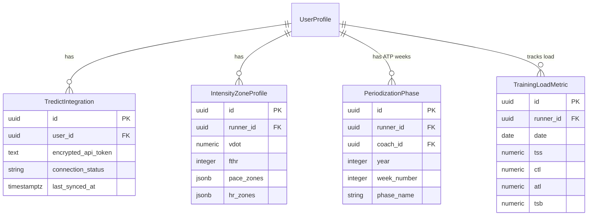

# Data Model: Pembaruan Platform LariSync - Otomasi Tredict, VDOT/FTHR, Periodisasi ATP & Dasbor Training Load

## Overview

Dokumen ini mendefinisikan skema tabel database PostgreSQL di Supabase, aturan validasi, hubungan antar-entitas, dan kebijakan Row Level Security (RLS) untuk fitur baru.

---

## Entitas & Skema Tabel

### 1. `tredict_integrations`
Memuat kredensial dan status integrasi API Tredict untuk pengguna (Pelari / Pelatih).

```sql
CREATE TABLE public.tredict_integrations (
    id UUID PRIMARY KEY DEFAULT gen_random_uuid(),
    user_id UUID NOT NULL REFERENCES auth.users(id) ON DELETE CASCADE,
    encrypted_api_token TEXT NOT NULL,
    connection_status VARCHAR(50) NOT NULL DEFAULT 'connected', -- 'connected', 'error', 'disconnected'
    last_synced_at TIMESTAMPTZ,
    created_at TIMESTAMPTZ NOT NULL DEFAULT now(),
    updated_at TIMESTAMPTZ NOT NULL DEFAULT now(),
    CONSTRAINT unique_user_tredict UNIQUE (user_id)
);
```

#### Aturan RLS:
- **Select / Insert / Update / Delete**: Hanya pengguna pemilik (`auth.uid() = user_id`) atau Pelatih yang tertaut (`coach_id` di profil pelari).

---

### 2. `intensity_zone_profiles`
Memuat profil zona intensitas hasil kalkulasi VDOT dan/atau FTHR.

```sql
CREATE TABLE public.intensity_zone_profiles (
    id UUID PRIMARY KEY DEFAULT gen_random_uuid(),
    runner_id UUID NOT NULL REFERENCES auth.users(id) ON DELETE CASCADE,
    vdot NUMERIC(4, 1), -- Misal: 45.5
    fthr INTEGER,      -- Misal: 165 bpm
    pace_zones JSONB NOT NULL DEFAULT '{}'::jsonb, -- { E: "5:30-6:15", M: "4:50-5:25", ... }
    hr_zones JSONB NOT NULL DEFAULT '{}'::jsonb,   -- { Z1: "120-135", Z2: "136-150", ... }
    created_at TIMESTAMPTZ NOT NULL DEFAULT now(),
    updated_at TIMESTAMPTZ NOT NULL DEFAULT now(),
    CONSTRAINT unique_runner_zones UNIQUE (runner_id)
);
```

#### Aturan RLS:
- **Select**: Pelari bersangkutan dan Pelatih tertaut.
- **Insert / Update**: Hanya Pelatih tertaut atau Pelari pemilik.

---

### 3. `periodization_phases`
Memuat pemetaan label fase periodisasi tahunan (ATP) per minggu.

```sql
CREATE TABLE public.periodization_phases (
    id UUID PRIMARY KEY DEFAULT gen_random_uuid(),
    runner_id UUID NOT NULL REFERENCES auth.users(id) ON DELETE CASCADE,
    coach_id UUID NOT NULL REFERENCES auth.users(id) ON DELETE CASCADE,
    year INTEGER NOT NULL,       -- Misal: 2026
    week_number INTEGER NOT NULL, -- 1 s.d. 52
    phase_name VARCHAR(50) NOT NULL, -- 'Prep', 'Base', 'Build', 'Peak', 'Race', 'Transition'
    notes TEXT,
    created_at TIMESTAMPTZ NOT NULL DEFAULT now(),
    updated_at TIMESTAMPTZ NOT NULL DEFAULT now(),
    CONSTRAINT unique_runner_week_year UNIQUE (runner_id, year, week_number)
);
```

#### Aturan RLS:
- **Select**: Pelari bersangkutan dan Pelatih tertaut.
- **Insert / Update / Delete**: Pelatih tertaut.

---

### 4. `training_load_metrics`
Memuat log beban latihan harian/mingguan dan akumulasi Fitness/Fatigue.

```sql
CREATE TABLE public.training_load_metrics (
    id UUID PRIMARY KEY DEFAULT gen_random_uuid(),
    runner_id UUID NOT NULL REFERENCES auth.users(id) ON DELETE CASCADE,
    date DATE NOT NULL,
    tss NUMERIC(6, 1) NOT NULL DEFAULT 0.0, -- Training Stress Score
    ctl NUMERIC(6, 1) NOT NULL DEFAULT 0.0, -- Chronic Training Load (Fitness)
    atl NUMERIC(6, 1) NOT NULL DEFAULT 0.0, -- Acute Training Load (Fatigue)
    tsb NUMERIC(6, 1) NOT NULL DEFAULT 0.0, -- Training Stress Balance (Form)
    source VARCHAR(50) NOT NULL DEFAULT 'tredict', -- 'tredict', 'manual'
    created_at TIMESTAMPTZ NOT NULL DEFAULT now(),
    CONSTRAINT unique_runner_load_date UNIQUE (runner_id, date)
);
```

#### Aturan RLS:
- **Select**: Pelari bersangkutan dan Pelatih tertaut.
- **Insert / Update**: System API Route / Pelatih tertaut.

---

## Diagram Hubungan Entitas (ERD)


