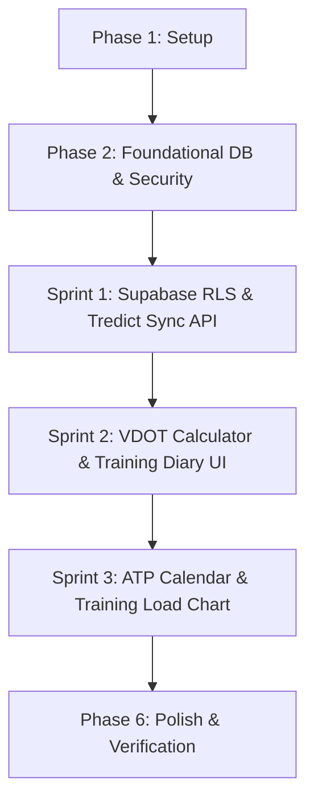

# Tasks: Pembaruan Platform LariSync - Otomasi Tredict, Kalkulator VDOT/FTHR, Periodisasi ATP & Dasbor Training Load

**Feature**: Pembaruan Platform LariSync - Otomasi Tredict, VDOT/FTHR, Periodisasi ATP & Training Load
**Branch**: `002-tredict-analytics-atp`
**Spec**: [spec.md](file:///c:/Users/kellog/Documents/Data%20Process/runcoach/specs/002-tredict-analytics-atp/spec.md) | **Plan**: [plan.md](file:///c:/Users/kellog/Documents/Data%20Process/runcoach/specs/002-tredict-analytics-atp/plan.md)

---

## Phase 1: Setup & Environment Initialization

**Purpose**: Inisialisasi dependensi, tipe data TypeScript, dan konfigurasi environment dasar.

- [x] T001 Setup tipe TypeScript untuk entitas Tredict, VDOT, ATP, dan Training Load pada [src/types/index.ts](file:///c:/Users/kellog/Documents/Data%20Process/runcoach/src/types/index.ts)
- [x] T002 [P] Install dependensi grafik Recharts (`npm install recharts`) pada [package.json](file:///c:/Users/kellog/Documents/Data%20Process/runcoach/package.json)
- [x] T003 [P] Verifikasi variabel environment `TREDICT_API_TOKEN` pada [.env.local](file:///c:/Users/kellog/Documents/Data%20Process/runcoach/.env.local) dan [.env.example](file:///c:/Users/kellog/Documents/Data%20Process/runcoach/.env.example)

---

## Phase 2: Foundational (Database & Security Prerequisites)

**Purpose**: Fondasi database Supabase PostgreSQL dan keamanan yang WAJIB selesai sebelum antarmuka pengguna dibuat.

- [x] T004 Buat script migrasi Supabase DDL untuk 4 tabel baru (`tredict_integrations`, `intensity_zone_profiles`, `periodization_phases`, `training_load_metrics`) pada [supabase/migrations/20260827_tredict_analytics_atp.sql](file:///c:/Users/kellog/Documents/Data%20Process/runcoach/supabase/migrations/20260827_tredict_analytics_atp.sql)
- [x] T005 [P] Terapkan kebijakan Row Level Security (RLS) berstandar UU PDP untuk isolasi data pelari pada [supabase/migrations/20260827_tredict_analytics_atp.sql](file:///c:/Users/kellog/Documents/Data%20Process/runcoach/supabase/migrations/20260827_tredict_analytics_atp.sql)
- [x] T006 [P] Buat modul utilitas enkripsi/dekripsi token sensitif pada [src/lib/security.ts](file:///c:/Users/kellog/Documents/Data%20Process/runcoach/src/lib/security.ts)

**Checkpoint**: Skema database Supabase dan keamanan RLS siap.

---

## Phase 3: Sprint 1 - Infrastruktur Basis Data & Integrasi Tredict (Priority: P1)

**Goal**: Menyimpan Tredict API Key secara terenkripsi di Supabase dan menyediakan backend REST API route untuk menarik metrik latihan (durasi, detak jantung, pace) secara aman.

**Independent Test**: Kirim request ke `POST /api/tredict/sync` dan verifikasi data metrik latihan dari Tredict API tersimpan secara terenkripsi di database Supabase.

- [x] T007 [P] [US1] Buat fungsi client REST API Tredict untuk penarikan durasi, detak jantung rata-rata, dan pace pada [src/lib/tredict.ts](file:///c:/Users/kellog/Documents/Data%20Process/runcoach/src/lib/tredict.ts)
- [x] T008 [US1] Buat API Route `POST /api/tredict/sync` untuk mengeksekusi penarikan data Tredict dan menyimpan ke Supabase pada [src/app/api/tredict/sync/route.ts](file:///c:/Users/kellog/Documents/Data%20Process/runcoach/src/app/api/tredict/sync/route.ts)
- [x] T009 [US1] Tambahkan penanganan kesalahan otentikasi Tredict & downtime dengan pesan ramah pada [src/app/api/tredict/sync/route.ts](file:///c:/Users/kellog/Documents/Data%20Process/runcoach/src/app/api/tredict/sync/route.ts)

**Checkpoint**: Sprint 1 Selesai - Backend API Tredict & Supabase RLS berfungsi mandiri.

---

## Phase 4: Sprint 2 - Logika Inti Kalkulator & Buku Harian (Priority: P1)

**Goal**: Mengembangkan Kalkulator Zona Intensitas (VDOT/FTHR) dan Buku Harian Latihan (Training Diary) dengan tombol pemicu tunggal "Sinkronkan Metrik Terbaru" serta input RPE manual (0-10).

**Independent Test**: Pelatih/Pelari memasukkan VDOT 45/FTHR 165 dan melihat 5 zona terender < 1 detik. Pada Buku Harian, tombol "Sinkronkan Metrik Terbaru" menampilkan loading state, ter-disable saat dipicu, memunculkan toast notification, dan menyimpan skor RPE manual (0-10).

- [x] T010 [P] [US2] Buat modul logika kalkulasi matematika zona VDOT (Daniels' Formula) & FTHR (Friel Model) pada [src/lib/vdot.ts](file:///c:/Users/kellog/Documents/Data%20Process/runcoach/src/lib/vdot.ts)
- [x] T011 [US2] Buat API Route `POST /api/zones/calculate` untuk memproses VDOT/FTHR dan menyimpan profil zona pada [src/app/api/zones/calculate/route.ts](file:///c:/Users/kellog/Documents/Data%20Process/runcoach/src/app/api/zones/calculate/route.ts)
- [x] T012 [P] [US2] Buat komponen antarmuka Kalkulator Zona Intensitas VDOT/FTHR pada [src/components/coach/VdotCalculator.tsx](file:///c:/Users/kellog/Documents/Data%20Process/runcoach/src/components/coach/VdotCalculator.tsx)
- [x] T013 [P] [US2] Buat komponen tombol pemicu tunggal `TredictSyncButton` dengan disabled state visual, loading spinner, dan toast notification pada [src/components/common/TredictSyncButton.tsx](file:///c:/Users/kellog/Documents/Data%20Process/runcoach/src/components/common/TredictSyncButton.tsx)
- [x] T014 [US2] Buat halaman Buku Harian Latihan (Training Diary) yang mengintegrasikan metrik Tredict dan input RPE manual (skala 0-10) pada [src/app/dashboard/diary/page.tsx](file:///c:/Users/kellog/Documents/Data%20Process/runcoach/src/app/dashboard/diary/page.tsx)
- [x] T015 [P] [US2] Buat halaman antarmuka Kalkulator Zona di Dasbor Pelatih pada [src/app/dashboard/zones/page.tsx](file:///c:/Users/kellog/Documents/Data%20Process/runcoach/src/app/dashboard/zones/page.tsx)

**Checkpoint**: Sprint 2 Selesai - Kalkulator VDOT & Buku Harian Latihan ber-RPE berfungsi mandiri.

---

## Phase 5: Sprint 3 - UI/UX Kalender ATP & Dasbor Visual (Priority: P2)

**Goal**: Mengintegrasikan Kalender Periodisasi Musiman (ATP - Annual Training Plan) 6 fase dan Dasbor Grafik Training Load (Recharts: CTL/ATL/TSB) dengan penanganan error Tredict downtime.

**Independent Test**: Pelatih dapat menetapkan 6 fase periodisasi di kalender ATP mingguan dan melihat grafik time-series Fitness/Fatigue terender secara responsif di Dasbor Training Load.

- [x] T016 [P] [US3] Buat komponen Kalender Periodisasi Musiman ATP (52 Minggu) dengan 6 fase (`Prep`, `Base`, `Build`, `Peak`, `Race`, `Transition`) pada [src/components/coach/AtpCalendar.tsx](file:///c:/Users/kellog/Documents/Data%20Process/runcoach/src/components/coach/AtpCalendar.tsx)
- [x] T017 [US3] Buat halaman antarmuka Kalender ATP di Dasbor Pelatih pada [src/app/dashboard/periodization/page.tsx](file:///c:/Users/kellog/Documents/Data%20Process/runcoach/src/app/dashboard/periodization/page.tsx)
- [x] T018 [P] [US4] Buat komponen grafik time-series Recharts untuk Kebugaran (CTL), Kelelahan (ATL), dan Form (TSB) pada [src/components/coach/TrainingLoadChart.tsx](file:///c:/Users/kellog/Documents/Data%20Process/runcoach/src/components/coach/TrainingLoadChart.tsx)
- [x] T019 [US4] Buat halaman Dasbor Training Load dengan penanganan error fallback saat Tredict downtime pada [src/app/dashboard/training-load/page.tsx](file:///c:/Users/kellog/Documents/Data%20Process/runcoach/src/app/dashboard/training-load/page.tsx)

**Checkpoint**: Sprint 3 Selesai - Kalender ATP & Dasbor Training Load siap diproduksi.

---

## Phase 6: Polish & Cross-Cutting Concerns

**Purpose**: Pengujian performa, tipe TypeScript, dan verifikasi akhir.

- [x] T020 [P] Verifikasi seluruh tipe TypeScript dan linting proyek via `npm run build`
- [x] T021 Jalankan skenario verifikasi cepat pada [specs/002-tredict-analytics-atp/quickstart.md](file:///c:/Users/kellog/Documents/Data%20Process/runcoach/specs/002-tredict-analytics-atp/quickstart.md)

---

## Dependencies & Execution Order

### Parallel Opportunities

- **Sprint 1**: `T007` (Tredict REST Client) dapat dikerjakan paralel dengan `T006` (Security Encryption).
- **Sprint 2**: `T010` (VDOT Math) dan `T013` (TredictSyncButton) dapat dikerjakan paralel.
- **Sprint 3**: `T016` (ATP Calendar Component) dan `T018` (Training Load Chart) dapat dikerjakan paralel.

---

## Implementation Strategy

1. **Sprint 1 (Backend & DB)**: Rampungkan skema database Supabase, RLS UU PDP, dan endpoint `/api/tredict/sync`.
2. **Sprint 2 (Core Logic & Diary)**: Rampungkan kalkulator VDOT 5 zona dan halaman Buku Harian Latihan dengan tombol sinkronkan & RPE manual.
3. **Sprint 3 (Visual ATP & Charts)**: Rampungkan Kalender Periodisasi 6 fase dan Grafik Recharts Training Load (CTL/ATL/TSB).
4. **Verifikasi Final**: Jalankan `npm run build` untuk menjamin 0 compilation error.
